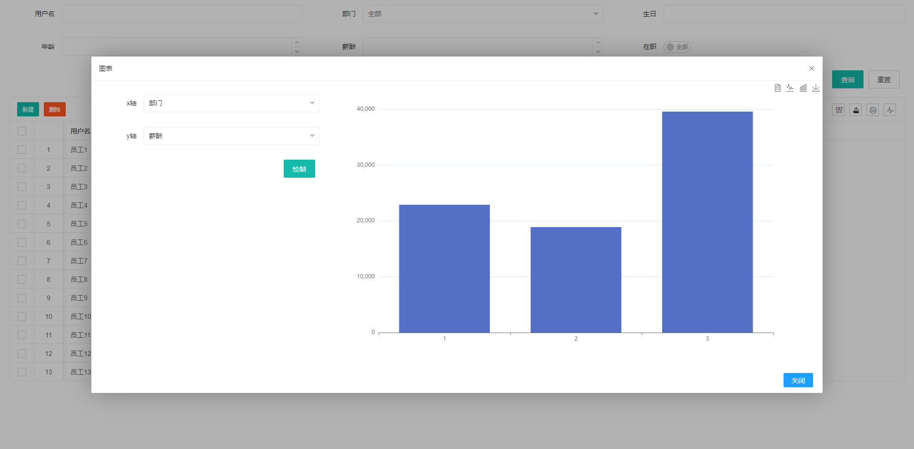

# Entity SQL - Java ORM 库

> Entity SQL 是一个轻量级的 Java ORM 工具库，旨在简化数据库操作，提供基于注解的实体映射和链式编程的 SQL 构建方式，快速构建单表维护和数据可视化界面。

[](https://jitpack.io/#com.gitee.wb04307201/entity-sql)
[](https://gitee.com/wb04307201/entity-sql)
[](https://gitee.com/wb04307201/entity-sql)
[](https://github.com/wb04307201/entity-sql)
[](https://github.com/wb04307201/entity-sql)  
  

## 代码示例
- [一键生成单表维护界面AI项目](https://gitee.com/wb04307201/one-table-ai)  
这是一个基于Spring Boot和AI技术的一键生成单表维护界面的应用。用户只需描述业务需求，系统会自动分析需求并生成相应的Java实体类和Web界面。  


## 功能特性

### 1. 实体映射
- 基于注解的实体类与数据库表映射
- 支持主键自动生成（UUID）
- 字段级别的详细配置（展示、编辑、搜索等）

### 2. SQL 构建
- 链式编程 API，易于使用和理解
- 支持常见的 CRUD 操作
- 自动处理 SQL 注入防护
- 支持分页查询
- 多种条件查询（等于、模糊匹配、范围查询等）

### 3. 多数据源支持
- 灵活的数据源配置
- 自动连接管理和释放

### 4. 类型转换
- 自动处理 Java 对象与数据库类型之间的转换
- 支持常见的数据类型（String、Integer、Date、BigDecimal 等）
[Table.java](entity-sql/src/main/java/cn/wubo/entity/sql/core/annotations/Table.java)
### 注解系统
- [@Table](entity-sql\src\main\java\cn\wubo\entity\sql\core\annotations\Table.java#L5-L11): 标注实体类对应的表名
- [@Column](entity-sql\src\main\java\cn\wubo\entity\sql\core\annotations\Column.java#L6-L21): 配置字段属性（类型、长度、展示方式等）
- [@Key](entity-sql\src\main\java\cn\wubo\entity\sql\core\annotations\Key.java#L7-L12): 标识主键字段及生成策略
- [@View](entity-sql\src\main\java\cn\wubo\entity\sql\core\annotations\View.java#L5-L12): 配置字段的展示属性
- [@Edit](entity-sql\src\main\java\cn\wubo\entity\sql\core\annotations\Edit.java#L7-L15): 配置字段的编辑属性
- [@Search](entity-sql\src\main\java\cn\wubo\entity\sql\core\annotations\Search.java#L8-L14): 配置字段的搜索属性

### SQL API（面向SQL构建）
- [SQL](entity-sql\src\main\java\cn\wubo\entity\sql\core\SQL.java#L4-L38): 静态方法入口，用于构建各种 SQL 语句
    - [SQL.query()](entity-sql\src\main\java\cn\wubo\entity\sql\core\SQL.java#L7-L10): 构建查询语句
      - 条件构建器:
        - 等值查询 ([eq](entity-sql\src\main\java\cn\wubo\entity\sql\core\segment\IWhere.java#L8-L8))
        - 不等值查询 ([neq](entity-sql\src\main\java\cn\wubo\entity\sql\core\segment\IWhere.java#L10-L10))
        - 模糊查询 ([like](entity-sql\src\main\java\cn\wubo\entity\sql\core\segment\IWhere.java#L20-L20), [notLike](entity-sql\src\main\java\cn\wubo\entity\sql\core\segment\IWhere.java#L22-L22), [llike](entity-sql\src\main\java\cn\wubo\entity\sql\core\segment\IWhere.java#L24-L24), [rlike](entity-sql\src\main\java\cn\wubo\entity\sql\core\segment\IWhere.java#L26-L26))
        - 范围查询 ([between](entity-sql\src\main\java\cn\wubo\entity\sql\core\segment\IWhere.java#L28-L28), [notBetween](entity-sql\src\main\java\cn\wubo\entity\sql\core\segment\IWhere.java#L30-L30))
        - 集合查询 ([in](entity-sql\src\main\java\cn\wubo\entity\sql\core\segment\IWhere.java#L32-L34), [notIn](entity-sql\src\main\java\cn\wubo\entity\sql\core\segment\IWhere.java#L38-L40))
        - 空值查询 ([isNull](entity-sql\src\main\java\cn\wubo\entity\sql\core\segment\IWhere.java#L44-L44), [isNotNull](entity-sql\src\main\java\cn\wubo\entity\sql\core\segment\IWhere.java#L46-L46))
        - 比较查询 ([gt](entity-sql\src\main\java\cn\wubo\entity\sql\core\segment\IWhere.java#L12-L12), [ge](entity-sql\src\main\java\cn\wubo\entity\sql\core\segment\IWhere.java#L14-L14), [lt](entity-sql\src\main\java\cn\wubo\entity\sql\core\segment\IWhere.java#L16-L16), [le](entity-sql\src\main\java\cn\wubo\entity\sql\core\segment\IWhere.java#L18-L18))
      - 分页支持
        - [page(int page, int pageSize)](entity-sql\src\main\java\cn\wubo\entity\sql\core\segment\IPage.java#L4-L4)分页查询。
    - [SQL.update()](entity-sql\src\main\java\cn\wubo\entity\sql\core\SQL.java#L10-L12): 构建更新语句
    - [SQL.insert()](entity-sql\src\main\java\cn\wubo\entity\sql\core\SQL.java#L14-L16): 构建插入语句
    - [SQL.delete()](entity-sql\src\main\java\cn\wubo\entity\sql\core\SQL.java#L18-L20): 构建删除语句
    - [SQL.createTable()](entity-sql\src\main\java\cn\wubo\entity\sql\core\SQL.java#L30-L32): 构建建表语句
    - [SQL.dropTable()](entity-sql\src\main\java\cn\wubo\entity\sql\core\SQL.java#L26-L28): 构建删表语句
    - [SQL.isTableExists()](entity-sql\src\main\java\cn\wubo\entity\sql\core\SQL.java#L22-L24): 检查表是否存在

### Entity API（面向实体操作）
- [Entity](entity-sql\src\main\java\cn\wubo\entity\sql\core\Entity.java#L8-L25): 针对实体对象的操作入口
    - [Entity.insertOrUpdate()](entity-sql\src\main\java\cn\wubo\entity\sql\core\Entity.java#L10-L12): 插入或更新实体
    - [Entity.query()](entity-sql\src\main\java\cn\wubo\entity\sql\core\Entity.java#L14-L16): 查询实体列表
    - [Entity.grtById()](entity-sql\src\main\java\cn\wubo\entity\sql\core\Entity.java#L18-L20): 根据主键获取实体
    - [Entity.deleteById()](entity-sql\src\main\java\cn\wubo\entity\sql\core\Entity.java#L22-L24): 根据主键删除实体


## 使用
### 引入依赖
增加 JitPack 仓库
```xml
<repositories>
    <repository>
        <id>jitpack.io</id>
        <url>https://jitpack.io</url>
    </repository>
</repositories>
```

```xml
<dependency>
    <groupId>com.gitee.wb04307201.entity-sql</groupId>
    <artifactId>entity-sql-spring-boot-starter</artifactId>
    <version>1.4.2</version>
</dependency>
```

## 使用

### SQL API（面向SQL构建）使用示例
```java
        if (dataSourceHelper.execute(SQL.isTableExists(User.class))) {
        dataSourceHelper.execute(SQL.dropTable(User.class));
        }
        dataSourceHelper.execute(SQL.createTable(User.class));

int count = dataSourceHelper.execute(SQL.insert(User.class).set(User::getId, "11111").set(User::getUserName, "11111"));
        Assertions.assertEquals(count, 1);

count = dataSourceHelper.execute(SQL.update(User.class).set(User::getUserName, "11111+++").eq(User::getId, "11111"));
        Assertions.assertEquals(count, 1);

        IntStream.range(0, 10).forEach(i -> {
        dataSourceHelper.execute(SQL.insert(User.class).set(User::getId, UUID.randomUUID()).set(User::getUserName, UUID.randomUUID()));
        });

List<User> userList = dataSourceHelper.execute(SQL.query(User.class));
        Assertions.assertEquals(userList.size(), 11);

count = dataSourceHelper.execute(SQL.delete(User.class).eq(User::getId, "11111"));

userList = dataSourceHelper.execute(SQL.query(User.class));
        Assertions.assertEquals(userList.size(), 10);

count = dataSourceHelper.execute(SQL.delete(User.class).isNotNull(User::getUserName));
        Assertions.assertEquals(count, 10);

userList = dataSourceHelper.execute(SQL.query(User.class).page(0,1));
        Assertions.assertEquals(userList.size(), 1);
```

### Entity API（面向实体操作）使用示例
先创建一个类
```java
package cn.wubo.entity.sql;

import cn.wubo.entity.sql.core.annotations.*;
import cn.wubo.entity.sql.core.enums.ColumnType;
import cn.wubo.entity.sql.core.enums.EditType;
import lombok.Data;

import java.time.LocalDate;

@Data
@Table(value = "test_user", init = true)
public class User {
    @Key
    @Column(value = "id",key = @Key(isKey = true))
    private String id;

    @Column(value = "user_name", label = "用户名", type = ColumnType.VARCHAR, length = 20, edit = @Edit(required = true),search = @Search(searchable = true))
    private String userName;

    @Column(value = "department", label = "部门",
            items = {@Item(value = "1", label = "部门1"), @Item(value = "2", label = "部门2"), @Item(value = "3", label = "部门3")},
            view = @View(width = 300),
            edit = @Edit(type = EditType.SELECT),
            search = @Search(searchable = true))
    private String department;

    @Column(value = "birth", label = "生日", type = ColumnType.DATE,edit = @Edit(type = EditType.DATE))
    private LocalDate birth;

    @Column(value = "age", label = "年龄", type = ColumnType.NUMBER, precision = 10, scale = 0,edit = @Edit(type = EditType.NUMBER))
    private Integer age;

    @Column(value = "amount", label = "薪酬", type = ColumnType.NUMBER, precision = 10, scale = 2,edit = @Edit(type = EditType.NUMBER))
    private Float amount;

    @Column(value = "status", label = "在职", type = ColumnType.VARCHAR, length = 1,
            items = {@Item(value = "Y", label = "在职"), @Item(value = "N", label = "离职")},
            view = @View(),
            edit = @Edit(type = EditType.CHECKBOX)
    )
    private String status;
}
```

使用
```java
        if (dataSourceHelper.execute(SQL.isTableExists(User.class))) {
        dataSourceHelper.execute(SQL.dropTable(User.class));
        }
        dataSourceHelper.execute(SQL.createTable(User.class));
User user = new User();
        user.setUserName("99999");
        user.setBirth(LocalDate.now());
        dataSourceHelper.execute(Entity.insertOrUpdate(user));

        user.setUserName("99999+");
        dataSourceHelper.execute(Entity.insertOrUpdate(user));

User user1 = dataSourceHelper.execute(Entity.grtById(user));
        Assertions.assertEquals(user1.getUserName(), "99999+");

List<User> userList = dataSourceHelper.execute(Entity.query(new User()));
        Assertions.assertEquals(userList.size(), 1);

Integer count = dataSourceHelper.execute(Entity.deleteById(user));
        Assertions.assertEquals(count, 1);

userList = dataSourceHelper.execute(Entity.query(new User()));
        Assertions.assertEquals(userList.size(), 0);
```

### 快速构建单表维护和数据可视化界面

```java
@Component
public class AppReadyListener implements ApplicationRunner {

    private final EntityWebService entityWebService;

    @Autowired
    public AppReadyListener(EntityWebService entityWebService) {
        this.entityWebService = entityWebService;
    }

    @Override
    public void run(ApplicationArguments args) throws Exception {
        // user 为页面访问标识，多个界面注意标识不要重复
        entityWebService.build("user", User.class);
    }
}
```

#### 页面访问标识访问页面
http://ip:port/entity/view/user
单表维护  

绘制图表  
