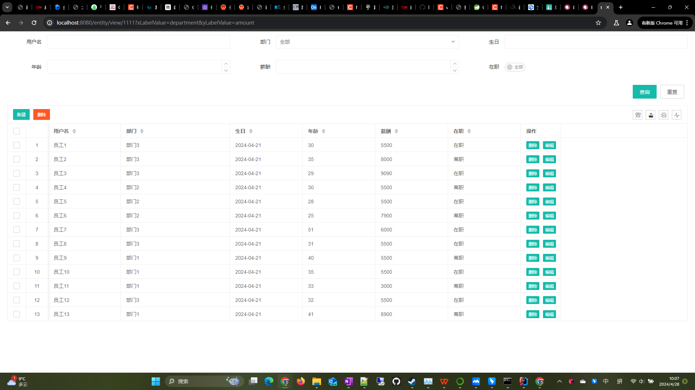

# SQL Forge

<div align="right">
  English | <a href="README.zh-CN.md">中文</a>
</div>

> SQL Forge is more than just an ORM framework, it provides the following features:
- **Entity**: Build `SQL` based on entity objects
- **Json API**: Call interface to describe database operations in `JSON` format
- **Template API**: `SQL` template engine
- **Calcite API**: Cross-database federated query
- **Amis**: Baidu Amis low-code front-end framework

[](https://jitpack.io/#com.gitee.wb04307201/sql-forge)
[](https://gitee.com/wb04307201/sql-forge)
[](https://gitee.com/wb04307201/sql-forge)
[](https://github.com/wb04307201/sql-forge)
[](https://github.com/wb04307201/sql-forge)  
  

## Usage
### Add Dependencies
Add JitPack repository
```xml
<repositories>
    <repository>
        <id>jitpack.io</id>
        <url>https://jitpack.io</url>
    </repository>
</repositories>
```

```xml
<dependency>
    <groupId>com.gitee.wb04307201.sql-forge</groupId>
    <artifactId>sql-forge-spring-boot-starter</artifactId>
    <version>1.5.1</version>
</dependency>
```

## Usage

### Entity Module
- [Entity](file://D:\developer\IdeaProjects\entity-sql\sql-forge-crud\src\main\java\cn\wubo\sql\forge\Entity.java) provides builders for database operations on entity objects, including delete, insert, query, update, and save operations, simplifying the `SQL` construction process.
- [EntityService](file://D:\developer\IdeaProjects\entity-sql\sql-forge-crud\src\main\java\cn\wubo\sql\forge\EntityService.java) is responsible for executing database operations for the **builders**.

#### Features
- Uses chain calls, with clean API design
- Supports type-safe generic operations
- Flexible configuration of query conditions through builder pattern
- Unified database operation entry point

#### Usage Examples

Assuming there is a user entity class [User](file://D:\developer\IdeaProjects\entity-sql\sql-forge-test\src\test\java\cn\wubo\sql\forge\User.java):

```java
@Autowired
private EntityService entityService;


// Query operation
EntitySelect<User> select = Entity.select(User.class)
                .distinct(true)
                .columns(User::getId, User::getUsername, User::getEmail)
                .orders(User::getUsername)
                .in(User::getUsername, "alice", "bob");
List<User> users = entityService.run(select);
Object key = entityService.run(insert);

// Paginated query operation
EntitySelectPage<User> select = Entity.selectPage(User.class)
        .distinct(true)
        .columns(User::getId, User::getUsername, User::getEmail)
        .orders(User::getUsername)
        .in(User::getUsername, "alice", "bob")
        .page(0, 1);
SelectPageResult<User> users = entityService.run(select);

// Insert operation  
EntityInsert<User> insert = Entity.insert(User.class).set(User::getId, id)
        .set(User::getUsername, "wb04307201")
        .set(User::getEmail, "wb04307201@gitee.com");
int count = entityService.run(update);

// Update operation
EntityUpdate<User> update = Entity.update(User.class)
        .set(User::getEmail, "wb04307201@github.com")
        .eq(User::getId, id);
int count = entityService.run(update);

// Delete operation
EntityDelete<User> delete = Entity.delete(User.class)
        .eq(User::getId, id);
count = entityService.run(delete);

// Object save operation (insert or update)
User user = new User();
user.setUsername("wb04307201");
user.setEmail("wb04307201@gitee.com");
user = entityService.run(Entity.save(user));
user.setEmail("wb04307201@github.com");
user = entityService.run(Entity.save(user));

// Object delete operation
int count = entityService.run(Entity.delete(user));
```

#### Query Builder Instructions

##### 1. Column Selection
- column(SFunction<T, ?> column) - Select a single column
- columns(SFunction<T, ?>... columns) - Select multiple columns

##### 2. Query Conditions
- eq(SFunction<T, ?> column, Object value) - Equal to
- neq(SFunction<T, ?> column, Object value) - Not equal to
- gt(SFunction<T, ?> column, Object value) - Greater than
- lt(SFunction<T, ?> column, Object value) - Less than
- gteq(SFunction<T, ?> column, Object value) - Greater than or equal to
- lteq(SFunction<T, ?> column, Object value) - Less than or equal to
- like(SFunction<T, ?> column, Object value) - Fuzzy matching
- notLike(SFunction<T, ?> column, Object value) - Not fuzzy matching
- leftLike(SFunction<T, ?> column, Object value) - Left fuzzy matching
- rightLike(SFunction<T, ?> column, Object value) - Right fuzzy matching
- between(SFunction<T, ?> column, Object value1, Object value2) - Within range
- notBetween(SFunction<T, ?> column, Object value1, Object value2) - Not within range
- in(SFunction<T, ?> column, Object... value) - In collection
- notIn(SFunction<T, ?> column, Object... value) - Not in collection
- isNull(SFunction<T, ?> column) - Is NULL
- isNotNull(SFunction<T, ?> column) - Is not NULL

##### 3. Sorting
- orderAsc(SFunction<T, ?> column) - Ascending sort
- orderDesc(SFunction<T, ?> column) - Descending sort
- orders(SFunction<T, ?>... columns) - Multi-column sorting (ascending by default)

##### 4. Pagination
- page(Integer pageIndex, Integer pageSize) - Set pagination parameters

##### 5. Distinct
- distinct(Boolean distinct) - Set whether to remove duplicates

#### Object Save Operation Instructions

Determine primary key fields based on the `@Id` annotation; throw `IllegalArgumentException` if no primary key field exists
- **Insert Condition**: Execute insert operation when primary key value is `null`
    - String type primary key: Automatically generate `UUID` as primary key value
    - Other type primary keys: Use database auto-generated primary key value
- **Update Condition**: Execute update operation when primary key value is not `null`
    - Use primary key value as update condition


### Json API Module
Allows frontends to operate databases without writing backend code, describing needed data structures and operations in `JSON` format, automatically generating corresponding `SQL` for execution and returning results.

- **Request Path**: `sql/forge/api/json/{method}/{tableName}`
- **Request Method**: `POST`
- **Content Type**: `application/json`
- **Path Parameters**:
  - `{method}`: Operation method type (delete, insert, select, update)
  - `{tableName}`: Database table name                             |

#### delete method

#### Request Format
```json
{
  "@where": [
    {
      "column": "field_name",
      "condition": "condition_type",
      "value": "value"
    }
  ],
  "@with_select": {
    "columns": ["field_name"],
    "wheres": [...],
    "page": {
      "pageIndex": 0,
      "pageSize": 10
    }
  }
}
```

#### Parameter Description
- `@where`: Array of deletion conditions, each containing:
  - column: Field name to match
  - condition: Condition type (EQ, NOT_EQ, GT, LT, GTEQ, LTEQ, LIKE, NOT_LIKE, LEFT_LIKE, RIGHT_LIKE, BETWEEN, NOT_BETWEEN, IN, NOT_IN, IS_NULL, IS_NOT_NULL)
  - value: Matching value
- `@with_select`: Optional query conditions to execute a query after deletion

#### insert method

#### Request Format
```json
{
  "@set": {
    "field_name1": "value1",
    "field_name2": "value2"
  },
  "@with_select": {
    "columns": ["field_name"],
    "wheres": [...],
    "page": {
      "pageIndex": 0,
      "pageSize": 10
    }
  }
}
```


#### Parameter Description
- `@set`: Key-value pairs of fields and values to insert, at least one field required
- `@with_select`: Optional query conditions to execute a query after insertion

#### select method

#### Request Format
```json
{
  "@column": ["field_name1", "field_name2"],
  "@where": [
    {
      "column": "field_name",
      "condition": "condition_type",
      "value": "value"
    }
  ],
  "@page": {
    "pageIndex": 0,
    "pageSize": 10
  },
  "@join": [
    {
      "type": "JOIN type",
      "joinTable": "joined_table_name",
      "on": "join_condition"
    }
  ],
  "@order": ["field_name ASC", "field_name DESC"],
  "@group": ["field_name"],
  "@distinct": false
}
```

#### select method

#### Request Format
```json
{
  "@column": ["field_name1", "field_name2"],
  "@where": [
    {
      "column": "field_name",
      "condition": "condition_type",
      "value": "value"
    }
  ],
  "@join": [
    {
      "type": "JOIN type",
      "joinTable": "joined_table_name",
      "on": "join_condition"
    }
  ],
  "@order": ["field_name ASC", "field_name DESC"],
  "@group": ["field_name"],
  "@distinct": false
}
```

##### Parameter Description
- `@column`: Array of fields to query, query all fields if empty
- `@where`: Array of query conditions
- `@join`: Array of join query conditions
- `@order`: Array of sort fields
- `@group`: Array of group fields
- `@distinct`: Whether to remove duplicates

#### selectPage method

#### Request Format
```json
{
  "@column": ["field_name1", "field_name2"],
  "@where": [
    {
      "column": "field_name",
      "condition": "condition_type",
      "value": "value"
    }
  ],
  "@page": {
    "pageIndex": 0,
    "pageSize": 10
  },
  "@join": [
    {
      "type": "JOIN type",
      "joinTable": "joined_table_name",
      "on": "join_condition"
    }
  ],
  "@order": ["field_name ASC", "field_name DESC"],
  "@distinct": false
}
```

##### Parameter Description
- `@column`: Array of fields to query, query all fields if empty
- `@where`: Array of query conditions
- `@page`: Pagination parameters
  - pageIndex: Page index (starting from 0)
  - pageSize: Page size
- `@join`: Array of join query conditions
- `@order`: Array of sort fields
- `@distinct`: Whether to remove duplicates

#### update method

##### Request Format
```json
{
  "@set": {
    "field_name1": "new_value1",
    "field_name2": "new_value2"
  },
  "@where": [
    {
      "column": "field_name",
      "condition": "condition_type",
      "value": "value"
    }
  ],
  "@with_select": {
    "columns": ["field_name"],
    "wheres": [...],
    "page": {
      "pageIndex": 0,
      "pageSize": 10
    }
  }
}
```

##### Parameter Description
- `@set`: Key-value pairs of fields and new values to update, at least one field required
- `@where`: Array of update conditions specifying which records to update
- `@with_select`: Optional query conditions to execute a query after update

#### Examples
```http request
POST http://localhost:8080/sql/forge/api/json/select/orders
Content-Type: application/json

{
    "@column": [
        "orders.id AS order_id",
        "users.username",
        "products.name AS product_name",
        "products.price",
        "orders.quantity",
        "(products.price * orders.quantity) AS total"
    ],
    "@where": [
        {
            "column": "users.username",
            "condition": "EQ",
            "value": "alice"
        }
    ],
    "@page": {
        "pageIndex": 0,
        "pageSize": 10
    },
    "@join": [
        {
            "type": "INNER_JOIN",
            "joinTable":"users",
            "on": "orders.user_id = users.id"
        },
        {
            "type": "INNER_JOIN",
            "joinTable":"products",
            "on": "orders.product_id = products.id"
        }
    ],
    "@order": [
        "orders.order_date"
    ],
    "@group": null,
    "@distinct": false
}
```

```http request
POST http://localhost:8080/sql/forge/api/json/selectPage/orders
Content-Type: application/json

{
    "@column": [
        "orders.id AS order_id",
        "users.username",
        "products.name AS product_name",
        "products.price",
        "orders.quantity",
        "(products.price * orders.quantity) AS total"
    ],
    "@where": [
        {
            "column": "users.username",
            "condition": "EQ",
            "value": "alice"
        }
    ],
    "@page": {
        "pageIndex": 0,
        "pageSize": 10
    },
    "@join": [
        {
            "type": "INNER_JOIN",
            "joinTable":"users",
            "on": "orders.user_id = users.id"
        },
        {
            "type": "INNER_JOIN",
            "joinTable":"products",
            "on": "orders.product_id = products.id"
        }
    ],
    "@order": [
        "orders.order_date"
    ],
    "@distinct": false
}
```

```http request
POST http://localhost:8080/sql/forge/api/json/insert/users
Content-Type: application/json

{
    "@set": [
        {
            "column": "id",
            "value": "26a05ba3-913d-4085-a505-36d40021c8d1"
        },
        {
            "column": "username",
            "value": "wb04307201"
        },
        {
            "column": "email",
            "value": "wb04307201@gitee.com"
        }
    ],
    "@with_select": {
        "@column": null,
        "@where": [
            {
                "column": "id",
                "condition": "EQ",
                "value": "26a05ba3-913d-4085-a505-36d40021c8d1"
            }
        ],
        "@page": null,
        "@join": null,
        "@order": null,
        "@group": null,
        "@distinct": false
    }
}
```

```http request
POST http://localhost:8080/sql/forge/api/json/update/users
Content-Type: application/json

{
    "@set": [
        {
            "column": "email",
            "value": "wb04307201@github.com"
        }
    ],
    "@where": [
        {
            "column": "id",
            "condition": "EQ",
            "value": "26a05ba3-913d-4085-a505-36d40021c8d1"
        }
    ],
    "@with_select": {
        "@column": null,
        "@where": [
            {
                "column": "id",
                "condition": "EQ",
                "value": "26a05ba3-913d-4085-a505-36d40021c8d1"
            }
        ],
        "@page": null,
        "@join": null,
        "@order": null,
        "@group": null,
        "@distinct": false
    }
}
```

```http request
POST http://localhost:8080/sql/forge/api/json/delete/users
Content-Type: application/json

{
    "@where": [
        {
            "column": "id",
            "condition": "EQ",
            "value": "26a05ba3-913d-4085-a505-36d40021c8d1"
        }
    ],
    "@with_select": {
        "@column": null,
        "@where": [
            {
                "column": "id",
                "condition": "EQ",
                "value": "26a05ba3-913d-4085-a505-36d40021c8d1"
            }
        ],
        "@page": null,
        "@join": null,
        "@order": null,
        "@group": null,
        "@distinct": false
    }
}
```

#### Configuration
Disable the **Json API Module** with `sql.forge.api.json.enabled=false`

### Template API Module
Provides `SQL` template engine functionality, supporting conditional judgment, loops, and other template syntax, dynamically generating `SQL` based on parameters for execution and returning results.
- **API Template Management**: Provides storage, query, deletion, and other management functions for API templates
- **Templated API Execution**: Supports executing predefined API templates through template ID and parameters

#### Template Management Interfaces

- `POST /sql/forge/api/template` - Save new API template
   - id: Template ID
   - context: Template content
- `GET /sql/forge/api/template/{id}` - Get template by ID
- `GET /sql/forge/api/template` - Get template list
- `DELETE /sql/forge/api/template/{id}` - Delete specified template by ID

#### Template Execution Interfaces

- `POST /sql/forge/api/template/execute/{id}` - Execute specified template by ID
  - Template parameters Map


### Examples
Template configuration:
```http request
POST http://localhost:8080/sql/forge/api/template
content-type: application/json

{
    "id": "ApiTemplate-test",
    "context": "SELECT * FROM users WHERE 1=1\n<if test=\"name != null && name != ''\">AND username = #{name}</if>\n<if test=\"ids != null && !ids.isEmpty()\"><foreach collection=\"ids\" item=\"id\" open=\"AND id IN (\" separator=\",\" close=\")\">#{id}</foreach></if>\n<if test=\"(name == null || name == '') && (ids == null || ids.isEmpty()) \">AND 0=1</if>\nORDER BY username DESC"
}
```

Execute template:
```http request
POST http://localhost:8080/sql/forge/api/template/execute/ApiTemplate-test
content-type: application/json

{
"name":"alice",
"ids":null
}
```

Response:
```json
[
  {
    "ID": "550e8400-e29b-41d4-a716-446655440000",
    "USERNAME": "alice",
    "EMAIL": "alice@example.com"
  }
]
```

#### Configuration
Disable the **Template API Module** with `sql.forge.api.template.enabled=false`

#### Persisting Templates
Implement your own template service by extending [IApiTemplateStorage.java](sql-forge-template/src/main/java/cn/wubo/sql/forge/IApiTemplateStorage.java).

### Calcite API Module
`SQL` template engine implemented based on `Apache Calcite`, used for executing cross-database federated queries.
- **Data Source Configuration**: Provides data source configuration functionality
- **API Template Management**: Provides storage, query, deletion, and other management functions for API templates
- **Templated API Execution**: Supports executing predefined API templates through template ID and parameters

#### Data Source Configuration Interface
- `POST sql/forge/api/calciteConfig` - Modify data source configuration
  - context: Data source configuration
- `GET sql/forge/api/calciteConfig` - Get data source configuration

#### Template Management Interfaces

- `POST /sql/forge/api/calcite` - Save new API template
  - id: Template ID
  - context: Template content
- `GET /sql/forge/api/calcite/{id}` - Get template by ID
- `GET /sql/forge/api/calcite` - Get template list
- `DELETE /sql/forge/api/calcite/{id}` - Delete specified template by ID

#### Template Execution Interfaces

- `POST /sql/forge/api/calcite/execute/{id}` - Execute specified template by ID
  - Template parameters Map

#### Examples
Data source configuration:
```http request
POST http://localhost:8080/sql/forge/api/calciteConfig
content-type: application/json

{
    "context": "{\n  \"version\": \"1.0\",\n  \"defaultSchema\": \"MYSQL\",\n  \"schemas\": [\n    {\n      \"factory\": \"org.apache.calcite.adapter.jdbc.JdbcSchema$Factory\",\n      \"name\": \"MYSQL\",\n      \"operand\": {\n        \"jdbcDriver\": \"com.mysql.cj.jdbc.Driver\",\n        \"jdbcUrl\": \"jdbc:mysql://localhost:3306/test\",\n        \"jdbcUser\": \"root\",\n        \"jdbcPassword\": \"123456\"\n      },\n      \"type\": \"custom\"\n    },\n    {\n      \"factory\": \"org.apache.calcite.adapter.jdbc.JdbcSchema$Factory\",\n      \"name\": \"POSTGRES\",\n      \"operand\": {\n        \"jdbcDriver\": \"org.postgresql.Driver\",\n        \"jdbcUrl\": \"jdbc:postgresql://localhost:5432/test\",\n        \"jdbcUser\": \"postgres\",\n        \"jdbcPassword\": \"123456\"\n      },\n      \"type\": \"custom\"\n    }\n  ]\n}"
}
```

Template configuration:
```http request
POST http://localhost:8080/sql/forge/api/calcite
content-type: application/json

{
    "id": "ApiCalciteTemplate-test",
    "context": "select student.name, sum(score.grade) as grade from MYSQL.student as student join POSTGRES.score as score on student.id=score.student_id where 1=1\r\n<if test=\"ids == null || ids.isEmpty()\">AND 0=1</if>\r\n<if test=\"ids != null && !ids.isEmpty()\"><foreach collection=\"ids\" item=\"id\" open=\"AND student.id IN (\" separator=\",\" close=\")\">#{id}</foreach></if>\r\ngroup by student.name"
}
```

Execute template:
```http request
POST http://localhost:8080/sql/forge/api/calcite/execute/ApiCalciteTemplate-test
content-type: application/json

{
    "ids": [
        1,
        2
    ]
}
```

Response:
```json
[
    {
        "name": "Xiao Ming",
        "grade": 80
    },
    {
        "name": "Xiao Hong",
        "grade": 90
    }
]
```

#### Configuration
Disable the **Calcite API Module** with `sql.forge.api.calcite.enabled=false`

#### Persisting Templates
Implement your own template service by extending [IApiCalciteStorage.java](sql-forge-calcite/src/main/java/cn/wubo/sql/forge/IApiCalciteStorage.java).

### Amis Module
Web pages built quickly using [Amis](https://aisuda.bce.baidu.com/amis/en-US/docs/index) combined with **Json API** module, **Template API** module, and **Calcite API** module.

#### Template Management Interfaces

- `POST /sql/forge/amis/template` - Save new API template
  - id: Template ID
  - context: Template content
- `GET /sql/forge/amis/template/{id}` - Get template by ID
- `GET /sql/forge/amis/template` - Get template list
- `DELETE /sql/forge/amis/template/{id}` - Delete specified template by ID

#### Web page

- `/sql/forge/amis?id={id}` - Open web page with specified ID

#### Example
Template configuration:
```http request
POST http://localhost:8080/sql/forge/amis/template
content-type: application/json

{
    "id": "AmisTemplate-crud-test",
    "context": "{\n  \"type\": \"page\",\n  \"body\": [\n    {\n      \"type\": \"crud\",\n      \"id\": \"crud_users\",\n      \"api\": {\n        \"method\": \"post\",\n        \"url\": \"/sql/forge/api/json/selectPage/users\",\n        \"data\": {\n          \"@where\": [\n            {\n              \"column\": \"USERNAME\",\n              \"condition\": \"LIKE\",\n              \"value\": \"${USERNAME}\"\n            },\n            {\n              \"column\": \"EMAIL\",\n              \"condition\": \"LIKE\",\n              \"value\": \"${EMAIL}\"\n            }\n          ],\n          \"@order\": [\n            \"${default(orderBy && orderDir ? (orderBy + ' ' + orderDir):'',undefined)}\"\n          ],\n          \"@page\": {\n            \"pageIndex\": \"${page - 1}\",\n            \"pageSize\": \"${perPage}\"\n          }\n        }\n      },\n      \"headerToolbar\": [\n        {\n          \"label\": \"Add\",\n          \"type\": \"button\",\n          \"icon\": \"fa fa-plus\",\n          \"level\": \"primary\",\n          \"actionType\": \"drawer\",\n          \"drawer\": {\n            \"title\": \"Add Form\",\n            \"body\": {\n              \"type\": \"form\",\n              \"api\": {\n                \"method\": \"post\",\n                \"url\": \"/sql/forge/api/json/insert/users\",\n                \"data\": {\n                  \"@set\": \"$$\"\n                }\n              },\n              \"onEvent\": {\n                \"submitSucc\": {\n                  \"actions\": [\n                    {\n                      \"actionType\": \"reload\",\n                      \"componentId\": \"crud_users\"\n                    }\n                  ]\n                }\n              },\n              \"body\": [\n                {\n                  \"type\": \"uuid\",\n                  \"name\": \"ID\"\n                },\n                {\n                  \"type\": \"input-text\",\n                  \"name\": \"USERNAME\",\n                  \"label\": \"Username\"\n                },\n                {\n                  \"type\": \"input-text\",\n                  \"name\": \"EMAIL\",\n                  \"label\": \"Email\"\n                }\n              ]\n            }\n          },\n          \"id\": \"u:abd69a3d5f2f\"\n        },\n        \"bulkActions\",\n        {\n          \"type\": \"columns-toggler\",\n          \"align\": \"right\"\n        },\n        {\n          \"type\": \"drag-toggler\",\n          \"align\": \"right\"\n        },\n        {\n          \"type\": \"export-excel\",\n          \"label\": \"Export\",\n          \"icon\": \"fa fa-file-excel\",\n          \"api\": {\n            \"method\": \"post\",\n            \"url\": \"/sql/forge/api/json/select/users\",\n            \"data\": {\n              \"@where\": [\n                {\n                  \"column\": \"USERNAME\",\n                  \"condition\": \"LIKE\",\n                  \"value\": \"${USERNAME}\"\n                },\n                {\n                  \"column\": \"EMAIL\",\n                  \"condition\": \"LIKE\",\n                  \"value\": \"${EMAIL}\"\n                }\n              ]\n            }\n          },\n          \"align\": \"right\",\n          \"id\": \"u:23fd1bd3eed6\"\n        }\n      ],\n      \"footerToolbar\": [\n        \"statistics\",\n        {\n          \"type\": \"pagination\",\n          \"layout\": \"total,perPage,pager,go\"\n        }\n      ],\n      \"bulkActions\": [\n        {\n          \"label\": \"Bulk Delete\",\n          \"icon\": \"fa fa-trash\",\n          \"actionType\": \"ajax\",\n          \"api\": {\n            \"method\": \"post\",\n            \"url\": \"/sql/forge/api/json/delete/users\",\n            \"data\": {\n              \"@where\": [\n                {\n                  \"column\": \"ID\",\n                  \"condition\": \"IN\",\n                  \"value\": \"${ids | split}\"\n                }\n              ]\n            }\n          },\n          \"confirmText\": \"Confirm bulk delete?\",\n          \"id\": \"u:260c8b61b2eb\"\n        }\n      ],\n      \"keepItemSelectionOnPageChange\": true,\n      \"labelTpl\": \"${USERNAME}\",\n      \"autoFillHeight\": true,\n      \"autoGenerateFilter\": true,\n      \"showIndex\": true,\n      \"primaryField\": \"ID\",\n      \"columns\": [\n        {\n          \"name\": \"ID\",\n          \"label\": \"ID\",\n          \"hidden\": true,\n          \"id\": \"u:34a08d89bc9f\"\n        },\n        {\n          \"name\": \"USERNAME\",\n          \"label\": \"Username\",\n          \"searchable\": {\n            \"type\": \"input-text\",\n            \"name\": \"USERNAME\",\n            \"label\": \"Username\",\n            \"placeholder\": \"Enter username\",\n            \"id\": \"u:f708e3b20d46\"\n          },\n          \"sortable\": true,\n          \"id\": \"u:50c01bf8113d\"\n        },\n        {\n          \"name\": \"EMAIL\",\n          \"label\": \"Email\",\n          \"searchable\": {\n            \"type\": \"input-text\",\n            \"name\": \"EMAIL\",\n            \"label\": \"Email\",\n            \"placeholder\": \"Enter email\",\n            \"id\": \"u:d9cc8b6e4365\"\n          },\n          \"sortable\": true,\n          \"id\": \"u:a5c3414c4e35\"\n        },\n        {\n          \"type\": \"operation\",\n          \"label\": \"Operations\",\n          \"buttons\": [\n            {\n              \"label\": \"Edit\",\n              \"type\": \"button\",\n              \"icon\": \"fa fa-pen-to-square\",\n              \"actionType\": \"drawer\",\n              \"drawer\": {\n                \"title\": \"Add Form\",\n                \"body\": {\n                  \"type\": \"form\",\n                  \"initApi\": {\n                    \"method\": \"post\",\n                    \"url\": \"/sql/forge/api/json/select/users\",\n                    \"data\": {\n                      \"@where\": [\n                        {\n                          \"column\": \"ID\",\n                          \"condition\": \"EQ\",\n                          \"value\": \"${ID}\"\n                        }\n                      ]\n                    },\n                    \"responseData\": {\n                      \"&\": \"${items | first}\"\n                    }\n                  },\n                  \"api\": {\n                    \"method\": \"post\",\n                    \"url\": \"/sql/forge/api/json/update/users\",\n                    \"data\": {\n                      \"@set\": \"$$\",\n                      \"@where\": [\n                        {\n                          \"column\": \"ID\",\n                          \"condition\": \"EQ\",\n                          \"value\": \"${ID}\"\n                        }\n                      ]\n                    }\n                  },\n                  \"onEvent\": {\n                    \"submitSucc\": {\n                      \"actions\": [\n                        {\n                          \"actionType\": \"reload\",\n                          \"componentId\": \"crud_users\"\n                        }\n                      ]\n                    }\n                  },\n                  \"body\": [\n                    {\n                      \"type\": \"input-text\",\n                      \"name\": \"USERNAME\",\n                      \"label\": \"Username\"\n                    },\n                    {\n                      \"type\": \"input-text\",\n                      \"name\": \"EMAIL\",\n                      \"label\": \"Email\"\n                    }\n                  ]\n                }\n              },\n              \"id\": \"u:5d5445ebe2c2\"\n            },\n            {\n              \"label\": \"Delete\",\n              \"type\": \"button\",\n              \"icon\": \"fa fa-minus\",\n              \"actionType\": \"ajax\",\n              \"level\": \"danger\",\n              \"confirmText\": \"Confirm deletion?\",\n              \"api\": {\n                \"method\": \"post\",\n                \"url\": \"/sql/forge/api/json/delete/users\",\n                \"data\": {\n                  \"@where\": [\n                    {\n                      \"column\": \"ID\",\n                      \"condition\": \"EQ\",\n                      \"value\": \"${ID}\"\n                    }\n                  ]\n                }\n              },\n              \"id\": \"u:f51bf9877ae6\"\n            }\n          ],\n          \"fixed\": \"right\",\n          \"id\": \"u:f4eaa2b25ecb\"\n        }\n      ],\n      \"perPageAvailable\": [\n        5,\n        10,\n        20,\n        50,\n        100\n      ],\n      \"messages\": {}\n    }\n  ],\n  \"id\": \"u:2cdf3d397166\",\n  \"asideResizor\": false,\n  \"pullRefresh\": {\n    \"disabled\": true\n  },\n  \"regions\": [\n    \"body\"\n  ]\n}"
}
```

Open web page:
`http://localhost:8080/sql/forge/amis?id=AmisTemplate-crud-test`



#### Configuration
Disable **Amis** with `sql.forge.amis.enabled=false`

#### Persisting Templates
Implement your own template service by extending [IAmisStorage.java](sql-forge-amis/src/main/java/cn/wubo/sql/forge/IAmisStorage.java).

### Console
Provides a simple web interface for debugging and template management:
- Database metadata viewing, SQL debugging
- Json API debugging
- Template API template maintenance, debugging
- Calcite API data source maintenance, SQL debugging, template management, debugging

- Amis template management, quick template creation, visual editing, preview


#### Configuration
Disable **Console** with `sql.forge.console.enabled=false`