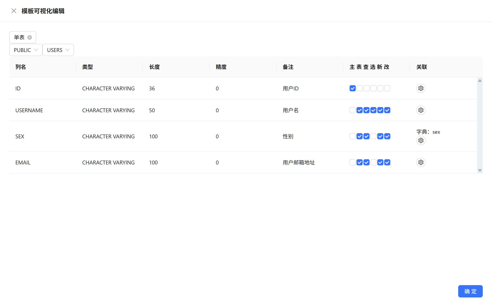
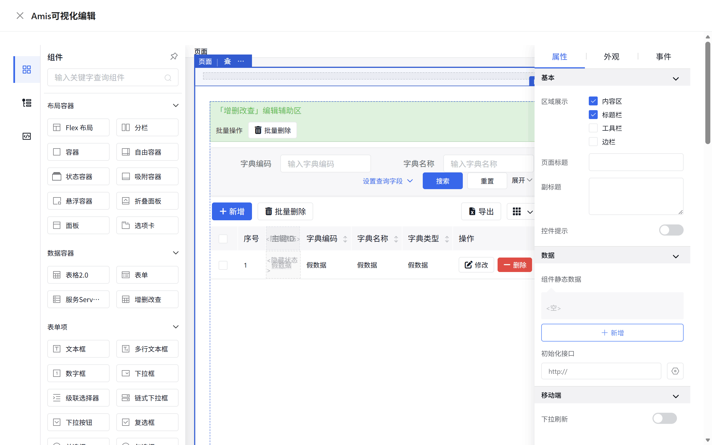

# SQL Forge - SQL工坊

<div align="right">
  <a href="README.md">English</a> | 中文
</div>

> SQL Forge 不只是一个ORM框架，它提供以下功能：
- **Entity**: 根据实体对象构建`SQL`
- **Json API**: 调用接口通过`JSON`格式描述数据库操作
- **Template API**: `SQL`模板引擎
- **Calcite API**: 跨数据库联邦查询
- **Amis**: 百度Amis低代码前端框架

[](https://jitpack.io/#com.gitee.wb04307201/sql-forge)
[](https://gitee.com/wb04307201/sql-forge)
[](https://gitee.com/wb04307201/sql-forge)
[](https://github.com/wb04307201/sql-forge)
[](https://github.com/wb04307201/sql-forge)  
  

## 使用
### 引入依赖
增加 JitPack 仓库
```xml
<repositories>
    <repository>
        <id>jitpack.io</id>
        <url>https://jitpack.io</url>
    </repository>
</repositories>
```

```xml
<dependency>
    <groupId>com.gitee.wb04307201.sql-forge</groupId>
    <artifactId>sql-forge-spring-boot-starter</artifactId>
    <version>1.5.4</version>
</dependency>
```

## 使用

### Entity 模块
- [Entity](file://D:\developer\IdeaProjects\entity-sql\sql-forge-crud\src\main\java\cn\wubo\sql\forge\Entity.java) 提供了对实体对象进行数据库操作的构建器，包括删除、插入、查询、更新、保存等操作，简化`SQL`构建过程。
- [EntityService](file://D:\developer\IdeaProjects\entity-sql\sql-forge-crud\src\main\java\cn\wubo\sql\forge\EntityService.java) 负责执行**构建器**的数据库操作。

#### 特点
- 使用链式调用，API 设计简洁
- 支持类型安全的泛型操作
- 通过构建器模式灵活配置查询条件
- 统一的数据库操作入口
- 

#### 使用示例

假设有一个用户实体类 [User](file://D:\developer\IdeaProjects\entity-sql\sql-forge-test\src\test\java\cn\wubo\sql\forge\User.java)：

```java
@Autowired
private EntityService entityService;


// 查询操作
EntitySelect<User> select = Entity.select(User.class)
                .distinct(true)
                .columns(User::getId, User::getUsername, User::getEmail)
                .orders(User::getUsername)
                .in(User::getUsername, "alice", "bob");
List<User> users = entityService.run(select);
Object key = entityService.run(insert);

// 分页查询操作
EntitySelectPage<User> select = Entity.selectPage(User.class)
        .distinct(true)
        .columns(User::getId, User::getUsername, User::getEmail)
        .orders(User::getUsername)
        .in(User::getUsername, "alice", "bob")
        .page(0, 1);
SelectPageResult<User> users = entityService.run(select);

// 插入操作  
EntityInsert<User> insert = Entity.insert(User.class).set(User::getId, id)
        .set(User::getUsername, "wb04307201")
        .set(User::getEmail, "wb04307201@gitee.com");
int count = entityService.run(update);

// 更新操作
EntityUpdate<User> update = Entity.update(User.class)
        .set(User::getEmail, "wb04307201@github.com")
        .eq(User::getId, id);
int count = entityService.run(update);

// 删除操作
EntityDelete<User> delete = Entity.delete(User.class)
        .eq(User::getId, id);
count = entityService.run(delete);

// 对象保存操作（插入或更新）
User user = new User();
user.setUsername("wb04307201");
user.setEmail("wb04307201@gitee.com");
user = entityService.run(Entity.save(user));
user.setEmail("wb04307201@github.com");
user = entityService.run(Entity.save(user));

// 对象删除操作
int count = entityService.run(Entity.delete(user));
```

#### 查询构造说明

##### 1. 列选择
- column(SFunction<T, ?> column) - 选择单个列
- columns(SFunction<T, ?>... columns) - 选择多个列

##### 2. 查询条件
- eq(SFunction<T, ?> column, Object value) - 等于
- neq(SFunction<T, ?> column, Object value) - 不等于
- gt(SFunction<T, ?> column, Object value) - 大于
- lt(SFunction<T, ?> column, Object value) - 小于
- gteq(SFunction<T, ?> column, Object value) - 大于等于
- lteq(SFunction<T, ?> column, Object value) - 小于等于
- like(SFunction<T, ?> column, Object value) - 模糊匹配
- notLike(SFunction<T, ?> column, Object value) - 不模糊匹配
- leftLike(SFunction<T, ?> column, Object value) - 左模糊匹配
- rightLike(SFunction<T, ?> column, Object value) - 右模糊匹配
- between(SFunction<T, ?> column, Object value1, Object value2) - 在范围内
- notBetween(SFunction<T, ?> column, Object value1, Object value2) - 不在范围内
- in(SFunction<T, ?> column, Object... value) - 在集合中
- notIn(SFunction<T, ?> column, Object... value) - 不在集合中
- isNull(SFunction<T, ?> column) - 为 NULL
- isNotNull(SFunction<T, ?> column) - 不为 NULL

##### 3. 排序
- orderAsc(SFunction<T, ?> column) - 升序排序
- orderDesc(SFunction<T, ?> column) - 降序排序
- orders(SFunction<T, ?>... columns) - 多列排序（默认升序）

##### 4. 分页
- page(Integer pageIndex, Integer pageSize) - 设置分页参数

##### 5. 去重
- distinct(Boolean distinct) - 设置是否去重

#### 对象保存操作构造说明

根据`@Id`注解判断主键字段，如果没有主键字段，抛出 `IllegalArgumentException`
- **插入条件**: 当主键值为 `null` 时执行插入操作
    - `String` 类型主键：自动生成 `UUID` 作为主键值
    - 其他类型主键：使用数据库自动生成的主键值
- **更新条件**: 当主键值不为 `null` 时执行更新操作
    - 使用主键值作为更新条件


### Json API 模块
让前端无需编写后端代码即可操作数据库，通过`JSON`格式描述自己需要的数据结构和操作，后端自动生成对应的`SQL`执行并返回结果。

- **请求路径**: `sql/forge/api/json/{method}/{tableName}`
- **请求方法**: `POST`
- **内容类型**: `application/json`
- **路径参数**:
  - `{method}`: 操作方法类型(delete、insert、select、update)
  - `{tableName}`: 数据库表名称                             |

#### delete 方法

#### 请求格式
```json
{
  "@where": [
    {
      "column": "字段名",
      "condition": "条件类型",
      "value": "值"
    }
  ],
  "@with_select": {
    // 删除后后查询json
  }
}
```

#### 参数说明
- `@where`: 删除条件数组，每个条件包含：
  - column: 要匹配的字段名
  - condition: 条件类型（EQ、NOT_EQ、GT、LT、GTEQ、LTEQ、LIKE、NOT_LIKE、LEFT_LIKE、RIGHT_LIKE、BETWEEN、NOT_BETWEEN、IN、NOT_IN、IS_NULL、IS_NOT_NULL）
  - value: 匹配的值
- `@with_select`: 可选的查询条件，用于在删除后执行一个查询

#### insert 方法

#### 请求格式
```json
{
  "@set": {
    "字段名1": "值1",
    "字段名2": "值2"
  },
  "@with_select": {
    // 删除后后查询json
  }
}
```

#### 参数说明
- `@set`: 要插入的字段和值的键值对，至少需要一个字段
- `@with_select`: 可选的查询条件，用于插入后执行一个查询

#### select 方法

#### 请求格式
```json
{
  "@column": ["字段名1", "字段名2"],
  "@where": [
    {
      "column": "字段名",
      "condition": "条件类型",
      "value": "值"
    }
  ],
  "@join": [
    {
      "type": "JOIN类型",
      "joinTable": "关联表名",
      "on": "关联条件"
    }
  ],
  "@order": ["字段名 ASC", "字段名 DESC"],
  "@group": ["字段名"],
  "@distince": false
}
```

##### 参数说明
- `@column`: 要查询的字段数组，为空则查询所有字段
- `@where`: 查询条件数组
- `@join`: 关联查询条件数组
- `@order`: 排序字段数组
- `@group`: 分组字段数组
- `@distince`: 是否去重

#### selectPage 方法

#### 请求格式
```json
{
  "@column": ["字段名1", "字段名2"],
  "@where": [
    {
      "column": "字段名",
      "condition": "条件类型",
      "value": "值"
    }
  ],
  "@page": {
    "pageIndex": 0,
    "pageSize": 10
  },
  "@join": [
    {
      "type": "JOIN类型",
      "joinTable": "关联表名",
      "on": "关联条件"
    }
  ],
  "@order": ["字段名 ASC", "字段名 DESC"],
  "@distince": false
}
```

##### 参数说明
- `@column`: 要查询的字段数组，为空则查询所有字段
- `@where`: 查询条件数组
- `@page`分页参数
  - pageIndex: 页码（从0开始）
  - pageSize: 每页大小
- `@join`: 关联查询条件数组
- `@order`: 排序字段数组
- `@distince`: 是否去重

#### update 方法

##### 请求格式
```json
{
  "@set": {
    "字段名1": "新值1",
    "字段名2": "新值2"
  },
  "@where": [
    {
      "column": "字段名",
      "condition": "条件类型",
      "value": "值"
    }
  ],
  "@with_select": {
    // 删除后后查询json
  }
}
```

##### 参数说明
- `@set`: 要更新的字段和新值的键值对，至少需要一个字段
- `@where`: 更新条件数组，指定要更新哪些记录
- `@with_select`: 可选的查询条件，用于更新后执行一个查询

#### 示例
```http request
POST http://localhost:8080/sql/forge/api/json/select/orders
Content-Type: application/json

{
  "@column": [
    "orders.id AS order_id",
    "users.username",
    "products.name AS product_name",
    "products.price",
    "orders.quantity",
    "(products.price * orders.quantity) AS total"
  ],
  "@where": [
    {
      "column": "users.username",
      "condition": "EQ",
      "value": "alice"
    }
  ],
  "@join": [
    {
      "type": "INNER_JOIN",
      "joinTable": "users",
      "on": "orders.user_id = users.id"
    },
    {
      "type": "INNER_JOIN",
      "joinTable": "products",
      "on": "orders.product_id = products.id"
    }
  ],
  "@order": [
    "orders.order_date"
  ],
  "@group": null,
  "@distince": false
}
```

```http request
POST http://localhost:8080/sql/forge/api/json/selectPage/orders
Content-Type: application/json

{
  "@column": [
    "orders.id AS order_id",
    "users.username",
    "products.name AS product_name",
    "products.price",
    "orders.quantity",
    "(products.price * orders.quantity) AS total"
  ],
  "@where": [
    {
      "column": "users.username",
      "condition": "EQ",
      "value": "alice"
    }
  ],
  "@page": {
    "pageIndex": 0,
    "pageSize": 10
  },
  "@join": [
    {
      "type": "INNER_JOIN",
      "joinTable": "users",
      "on": "orders.user_id = users.id"
    },
    {
      "type": "INNER_JOIN",
      "joinTable": "products",
      "on": "orders.product_id = products.id"
    }
  ],
  "@order": [
    "orders.order_date"
  ],
  "@distince": false
}
```

```http request
POST http://localhost:8080/sql/forge/api/json/insert/users
Content-Type: application/json

{
  "@set": {
    "id": "26a05ba3-913d-4085-a505-36d40021c8d1",
    "username": "wb04307201",
    "email": "wb04307201@gitee.com"
  },
  "@with_select": {
    "@column": null,
    "@where": [
      {
        "column": "id",
        "condition": "EQ",
        "value": "26a05ba3-913d-4085-a505-36d40021c8d1"
      }
    ],
    "@join": null,
    "@order": null,
    "@group": null,
    "@distince": false
  }
}
```

```http request
POST http://localhost:8080/sql/forge/api/json/update/users
Content-Type: application/json

{
  "@set": {
    "email": "wb04307201@github.com"
  },
  "@where": [
    {
      "column": "id",
      "condition": "EQ",
      "value": "26a05ba3-913d-4085-a505-36d40021c8d1"
    }
  ],
  "@with_select": {
    "@column": null,
    "@where": [
      {
        "column": "id",
        "condition": "EQ",
        "value": "26a05ba3-913d-4085-a505-36d40021c8d1"
      }
    ],
    "@join": null,
    "@order": null,
    "@group": null,
    "@distince": false
  }
}
```

```http request
POST http://localhost:8080/sql/forge/api/json/delete/users
Content-Type: application/json

{
  "@where": [
    {
      "column": "id",
      "condition": "EQ",
      "value": "26a05ba3-913d-4085-a505-36d40021c8d1"
    }
  ],
  "@with_select": {
    "@column": null,
    "@where": [
      {
        "column": "id",
        "condition": "EQ",
        "value": "26a05ba3-913d-4085-a505-36d40021c8d1"
      }
    ],
    "@join": null,
    "@order": null,
    "@group": null,
    "@distince": false
  }
}
```

#### 在方法执行前调整json
可通过实现[IExecute.java](sql-forge-crud/src/main/java/cn/wubo/sql/forge/inter/IExecute.java)接口自定义方法执行前的json调整，实现密码加密、自动更新时间戳、权限控制、日志、审计等

在Insert时对密码进行加密示例：
```java
@Component
public class Argon2InsertExecute implements IExecute<Insert> {
  @Override
  public Insert before(String tableName, Insert insert) {
    if ("users".equalsIgnoreCase(tableName)){
      if (insert.sets().keySet().stream().anyMatch("password"::equalsIgnoreCase)){
        Map<String, Object> newSets = new HashMap<>();
        insert.sets().forEach((k, v) -> {
          if ("password".equalsIgnoreCase(k) && v instanceof String str && StringUtils.hasText(str)){
            Argon2 argon2 = Argon2Factory.create();
            char[] password = str.toCharArray();
            newSets.put(k, argon2.hash(10, 65536, 1, password));
          }else {
            newSets.put(k, v);
          }
        });
        return new Insert(newSets, insert.select());
      }
    }

    return insert;
  }
}
```

#### 配置
可通过`sql.forge.api.json.enabled=false`关闭**Json API 模块**

### Template API 模块
提供`SQL`模板引擎功能，支持条件判断、循环等模板语法，根据参数动态生成`SQL`执行并返回结果。
- **API 模板管理**：提供 API 模板的存储、查询、删除等管理功能
- **模板化 API 执行**：支持通过模板 ID 和参数来执行预定义的 API 模板

#### 模板管理接口

- `POST /sql/forge/api/template` - 保存新的 API 模板
   - id: 模板 ID
   - context: 模板内容
- `GET /sql/forge/api/template/{id}` - 根据 ID 获取模板
- `GET /sql/forge/api/template` - 获取模板列表
- `DELETE /sql/forge/api/template/{id}` - 删除指定 ID 的模板

#### 模板执行接口

- `POST /sql/forge/api/template/execute/{id}` - 执行指定 ID 的模板
  - 模板参数 Map


### 示例
模板配置：
```http request
POST http://localhost:8080/sql/forge/api/template
content-type: application/json

{
    "id": "ApiTemplate-test",
    "context": "SELECT * FROM users WHERE 1=1\n<if test=\"name != null && name != ''\">AND username = #{name}</if>\n<if test=\"ids != null && !ids.isEmpty()\"><foreach collection=\"ids\" item=\"id\" open=\"AND id IN (\" separator=\",\" close=\")\">#{id}</foreach></if>\n<if test=\"(name == null || name == '') && (ids == null || ids.isEmpty()) \">AND 0=1</if>\nORDER BY username DESC"
}
```

执行模板：
```http request
POST http://localhost:8080/sql/forge/api/template/execute/ApiTemplate-test
content-type: application/json

{
"name":"alice",
"ids":null
}
```

响应：
```json
[
  {
    "ID": "550e8400-e29b-41d4-a716-446655440000",
    "USERNAME": "alice",
    "EMAIL": "alice@example.com"
  }
]
```

#### 配置
可通过`sql.forge.api.template.enabled=false`关闭**Template API 模块**

#### 持久化模板
继承[IApiTemplateStorage.java](sql-forge-template/src/main/java/cn/wubo/sql/forge/IApiTemplateStorage.java)实现自己的模板服务

### Calcite API 模块
基于`Apache Calcite`实现的`SQL`模板引擎，用于执行跨数据库的联邦查询。
- **数据源配置**：提供数据源的配置功能
- **API 模板管理**：提供 API 模板的存储、查询、删除等管理功能
- **模板化 API 执行**：支持通过模板 ID 和参数来执行预定义的 API 模板

#### 数据源配置接口
- `POST sql/forge/api/calciteConfig` - 修改数据源配置
  - context: 数据源配置
- `GET sql/forge/api/calciteConfig` - 获取数据源配置

#### 模板管理接口

- `POST /sql/forge/api/calcite` - 保存新的 API 模板
  - id: 模板 ID
  - context: 模板内容
- `GET /sql/forge/api/calcite/{id}` - 根据 ID 获取模板
- `GET /sql/forge/api/calcite` - 获取模板列表
- `DELETE /sql/forge/api/calcite/{id}` - 删除指定 ID 的模板

#### 模板执行接口

- `POST /sql/forge/api/calcite/execute/{id}` - 执行指定 ID 的模板
  - 模板参数 Map

#### 示例
数据源配置：
```http request
POST http://localhost:8080/sql/forge/api/calciteConfig
content-type: application/json

{
    "context": "{\n  \"version\": \"1.0\",\n  \"defaultSchema\": \"MYSQL\",\n  \"schemas\": [\n    {\n      \"factory\": \"org.apache.calcite.adapter.jdbc.JdbcSchema$Factory\",\n      \"name\": \"MYSQL\",\n      \"operand\": {\n        \"jdbcDriver\": \"com.mysql.cj.jdbc.Driver\",\n        \"jdbcUrl\": \"jdbc:mysql://localhost:3306/test\",\n        \"jdbcUser\": \"root\",\n        \"jdbcPassword\": \"123456\"\n      },\n      \"type\": \"custom\"\n    },\n    {\n      \"factory\": \"org.apache.calcite.adapter.jdbc.JdbcSchema$Factory\",\n      \"name\": \"POSTGRES\",\n      \"operand\": {\n        \"jdbcDriver\": \"org.postgresql.Driver\",\n        \"jdbcUrl\": \"jdbc:postgresql://localhost:5432/test\",\n        \"jdbcUser\": \"postgres\",\n        \"jdbcPassword\": \"123456\"\n      },\n      \"type\": \"custom\"\n    }\n  ]\n}"
}
```

模板配置：
```http request
POST http://localhost:8080/sql/forge/api/calcite
content-type: application/json

{
    "id": "ApiCalciteTemplate-test",
    "context": "select student.name, sum(score.grade) as grade from MYSQL.student as student join POSTGRES.score as score on student.id=score.student_id where 1=1\r\n<if test=\"ids == null || ids.isEmpty()\">AND 0=1</if>\r\n<if test=\"ids != null && !ids.isEmpty()\"><foreach collection=\"ids\" item=\"id\" open=\"AND student.id IN (\" separator=\",\" close=\")\">#{id}</foreach></if>\r\ngroup by student.name"
}
```

执行模板：
```http request
POST http://localhost:8080/sql/forge/api/calcite/execute/ApiCalciteTemplate-test
content-type: application/json

{
    "ids": [
        1,
        2
    ]
}
```

响应：
```json
[
    {
        "name": "小明",
        "grade": 80
    },
    {
        "name": "小红",
        "grade": 90
    }
]
```

#### 配置
可通过`sql.forge.api.calcite.enabled=false`关闭**Calcite API 模块**

#### 持久化模板
继承[IApiCalciteStorage.java](sql-forge-calcite/src/main/java/cn/wubo/sql/forge/IApiCalciteStorage.java)实现自己的模板服务

### Amis 模块
使用[Amis](https://aisuda.bce.baidu.com/amis/zh-CN/docs/index)配合**Json API**模块、**Template API**模块、**Calcite API**模块快速构建的Web页面。

#### 模板管理接口

- `POST /sql/forge/amis/template` - 保存新的 API 模板
  - id: 模板 ID
  - context: 模板内容
- `GET /sql/forge/amis/template/{id}` - 根据 ID 获取模板
- `GET /sql/forge/amis/template` - 获取模板列表
- `DELETE /sql/forge/amis/template/{id}` - 删除指定 ID 的模板

#### web页面

- `/sql/forge/amis?id={id}` - 打开指定 ID 的web页面

#### 示例
模板配置：
```http request
POST http://localhost:8080/sql/forge/amis/template
content-type: application/json

{
    "id": "AmisTemplate-crud-test",
    "context": "{\n  \"type\": \"page\",\n  \"body\": [\n    {\n      \"type\": \"crud\",\n      \"id\": \"crud_users\",\n      \"api\": {\n        \"method\": \"post\",\n        \"url\": \"/sql/forge/api/json/selectPage/users\",\n        \"data\": {\n          \"@where\": [\n            {\n              \"column\": \"USERNAME\",\n              \"condition\": \"LIKE\",\n              \"value\": \"${USERNAME}\"\n            },\n            {\n              \"column\": \"EMAIL\",\n              \"condition\": \"LIKE\",\n              \"value\": \"${EMAIL}\"\n            }\n          ],\n          \"@order\": [\n            \"${default(orderBy && orderDir ? (orderBy + ' ' + orderDir):'',undefined)}\"\n          ],\n          \"@page\": {\n            \"pageIndex\": \"${page - 1}\",\n            \"pageSize\": \"${perPage}\"\n          }\n        }\n      },\n      \"headerToolbar\": [\n        {\n          \"label\": \"新增\",\n          \"type\": \"button\",\n          \"icon\": \"fa fa-plus\",\n          \"level\": \"primary\",\n          \"actionType\": \"drawer\",\n          \"drawer\": {\n            \"title\": \"新增表单\",\n            \"body\": {\n              \"type\": \"form\",\n              \"api\": {\n                \"method\": \"post\",\n                \"url\": \"/sql/forge/api/json/insert/users\",\n                \"data\": {\n                  \"@set\": \"$$\"\n                }\n              },\n              \"onEvent\": {\n                \"submitSucc\": {\n                  \"actions\": [\n                    {\n                      \"actionType\": \"reload\",\n                      \"componentId\": \"crud_users\"\n                    }\n                  ]\n                }\n              },\n              \"body\": [\n                {\n                  \"type\": \"uuid\",\n                  \"name\": \"ID\"\n                },\n                {\n                  \"type\": \"input-text\",\n                  \"name\": \"USERNAME\",\n                  \"label\": \"用户名\"\n                },\n                {\n                  \"type\": \"input-text\",\n                  \"name\": \"EMAIL\",\n                  \"label\": \"邮箱\"\n                }\n              ]\n            }\n          },\n          \"id\": \"u:abd69a3d5f2f\"\n        },\n        \"bulkActions\",\n        {\n          \"type\": \"columns-toggler\",\n          \"align\": \"right\"\n        },\n        {\n          \"type\": \"drag-toggler\",\n          \"align\": \"right\"\n        },\n        {\n          \"type\": \"export-excel\",\n          \"label\": \"导出\",\n          \"icon\": \"fa fa-file-excel\",\n          \"api\": {\n            \"method\": \"post\",\n            \"url\": \"/sql/forge/api/json/select/users\",\n            \"data\": {\n              \"@where\": [\n                {\n                  \"column\": \"USERNAME\",\n                  \"condition\": \"LIKE\",\n                  \"value\": \"${USERNAME}\"\n                },\n                {\n                  \"column\": \"EMAIL\",\n                  \"condition\": \"LIKE\",\n                  \"value\": \"${EMAIL}\"\n                }\n              ]\n            }\n          },\n          \"align\": \"right\",\n          \"id\": \"u:23fd1bd3eed6\"\n        }\n      ],\n      \"footerToolbar\": [\n        \"statistics\",\n        {\n          \"type\": \"pagination\",\n          \"layout\": \"total,perPage,pager,go\"\n        }\n      ],\n      \"bulkActions\": [\n        {\n          \"label\": \"批量删除\",\n          \"icon\": \"fa fa-trash\",\n          \"actionType\": \"ajax\",\n          \"api\": {\n            \"method\": \"post\",\n            \"url\": \"/sql/forge/api/json/delete/users\",\n            \"data\": {\n              \"@where\": [\n                {\n                  \"column\": \"ID\",\n                  \"condition\": \"IN\",\n                  \"value\": \"${ids | split}\"\n                }\n              ]\n            }\n          },\n          \"confirmText\": \"确定要批量删除?\",\n          \"id\": \"u:260c8b61b2eb\"\n        }\n      ],\n      \"keepItemSelectionOnPageChange\": true,\n      \"labelTpl\": \"${USERNAME}\",\n      \"autoFillHeight\": true,\n      \"autoGenerateFilter\": true,\n      \"showIndex\": true,\n      \"primaryField\": \"ID\",\n      \"columns\": [\n        {\n          \"name\": \"ID\",\n          \"label\": \"ID\",\n          \"hidden\": true,\n          \"id\": \"u:34a08d89bc9f\"\n        },\n        {\n          \"name\": \"USERNAME\",\n          \"label\": \"用户名\",\n          \"searchable\": {\n            \"type\": \"input-text\",\n            \"name\": \"USERNAME\",\n            \"label\": \"用户名\",\n            \"placeholder\": \"输入用户名\",\n            \"id\": \"u:f708e3b20d46\"\n          },\n          \"sortable\": true,\n          \"id\": \"u:50c01bf8113d\"\n        },\n        {\n          \"name\": \"EMAIL\",\n          \"label\": \"邮箱\",\n          \"searchable\": {\n            \"type\": \"input-text\",\n            \"name\": \"EMAIL\",\n            \"label\": \"邮箱\",\n            \"placeholder\": \"输入邮箱\",\n            \"id\": \"u:d9cc8b6e4365\"\n          },\n          \"sortable\": true,\n          \"id\": \"u:a5c3414c4e35\"\n        },\n        {\n          \"type\": \"operation\",\n          \"label\": \"操作\",\n          \"buttons\": [\n            {\n              \"label\": \"修改\",\n              \"type\": \"button\",\n              \"icon\": \"fa fa-pen-to-square\",\n              \"actionType\": \"drawer\",\n              \"drawer\": {\n                \"title\": \"新增表单\",\n                \"body\": {\n                  \"type\": \"form\",\n                  \"initApi\": {\n                    \"method\": \"post\",\n                    \"url\": \"/sql/forge/api/json/select/users\",\n                    \"data\": {\n                      \"@where\": [\n                        {\n                          \"column\": \"ID\",\n                          \"condition\": \"EQ\",\n                          \"value\": \"${ID}\"\n                        }\n                      ]\n                    },\n                    \"responseData\": {\n                      \"&\": \"${items | first}\"\n                    }\n                  },\n                  \"api\": {\n                    \"method\": \"post\",\n                    \"url\": \"/sql/forge/api/json/update/users\",\n                    \"data\": {\n                      \"@set\": \"$$\",\n                      \"@where\": [\n                        {\n                          \"column\": \"ID\",\n                          \"condition\": \"EQ\",\n                          \"value\": \"${ID}\"\n                        }\n                      ]\n                    }\n                  },\n                  \"onEvent\": {\n                    \"submitSucc\": {\n                      \"actions\": [\n                        {\n                          \"actionType\": \"reload\",\n                          \"componentId\": \"crud_users\"\n                        }\n                      ]\n                    }\n                  },\n                  \"body\": [\n                    {\n                      \"type\": \"input-text\",\n                      \"name\": \"USERNAME\",\n                      \"label\": \"用户名\"\n                    },\n                    {\n                      \"type\": \"input-text\",\n                      \"name\": \"EMAIL\",\n                      \"label\": \"邮箱\"\n                    }\n                  ]\n                }\n              },\n              \"id\": \"u:5d5445ebe2c2\"\n            },\n            {\n              \"label\": \"删除\",\n              \"type\": \"button\",\n              \"icon\": \"fa fa-minus\",\n              \"actionType\": \"ajax\",\n              \"level\": \"danger\",\n              \"confirmText\": \"确认要删除？\",\n              \"api\": {\n                \"method\": \"post\",\n                \"url\": \"/sql/forge/api/json/delete/users\",\n                \"data\": {\n                  \"@where\": [\n                    {\n                      \"column\": \"ID\",\n                      \"condition\": \"EQ\",\n                      \"value\": \"${ID}\"\n                    }\n                  ]\n                }\n              },\n              \"id\": \"u:f51bf9877ae6\"\n            }\n          ],\n          \"fixed\": \"right\",\n          \"id\": \"u:f4eaa2b25ecb\"\n        }\n      ],\n      \"perPageAvailable\": [\n        5,\n        10,\n        20,\n        50,\n        100\n      ],\n      \"messages\": {}\n    }\n  ],\n  \"id\": \"u:2cdf3d397166\",\n  \"asideResizor\": false,\n  \"pullRefresh\": {\n    \"disabled\": true\n  },\n  \"regions\": [\n    \"body\"\n  ]\n}"
}
```

打开web页面：
`http://localhost:8080/sql/forge/amis?id=AmisTemplate-crud-test`


#### 配置
可通过`sql.forge.amis.enabled=false`关闭**Amis**

#### 持久化模板
继承[IAmisStorage.java](sql-forge-amis/src/main/java/cn/wubo/sql/forge/IAmisStorage.java)实现自己的模板服务

### 控制台
提供简单的Web界面用于调试和模板管理：
- 数据库元数据查看，sql调试
- Json API调试
- Template API模板维护，调试
- Calcite API数据源维护，sql调试，模板管理，调试

- Amis模板管理，快速创建模板，可视化编辑，预览
  - 模板化编辑
    
  - 可视化编辑
    

#### 配置
可通过`sql.forge.console.enabled=false`关闭**控制台**
